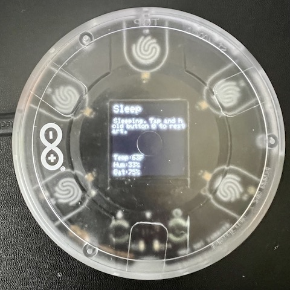
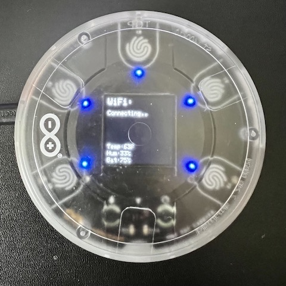
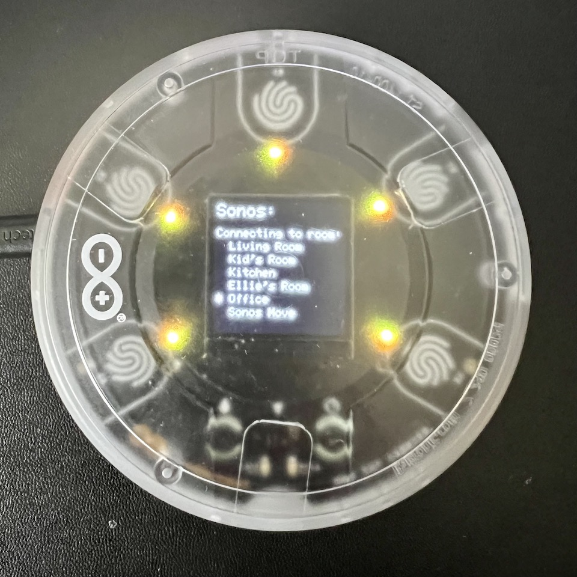
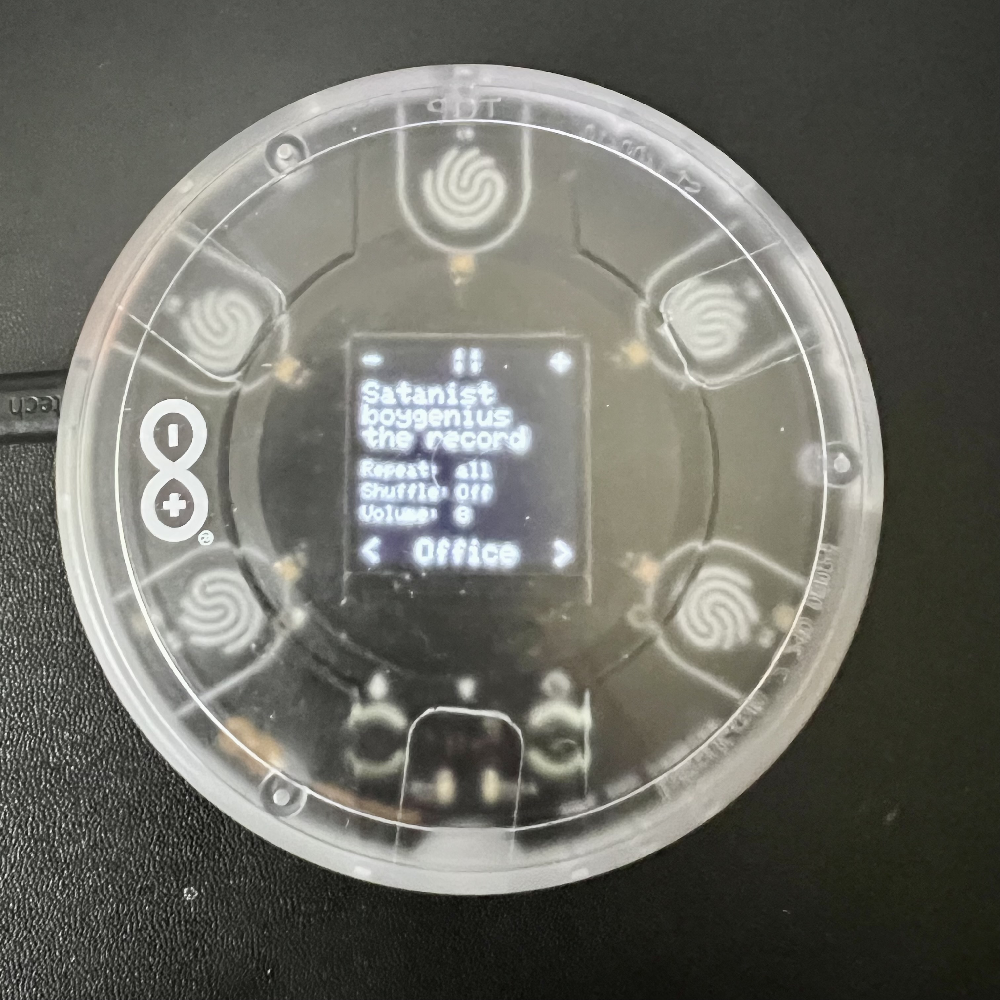

# Arduino MKR IoT Carrier Sonos Controller

## Prereqs:

- Install `arduino-cli`
- Have an instance of my fork of [`node-sonos-http-api`](https://github.com/lukekarrys/node-sonos-http-api) running and accessible
- Have an [Arduino MKR IoT Carrier](https://store-usa.arduino.cc/products/arduino-mkr-iot-carrier) + [Arduino MKR WiFi 1010](https://store-usa.arduino.cc/products/arduino-mkr-wifi-1010)

## Steps

1. Install libraries with `./run.sh -c install`
1. Create `Sonos/Secrets.h`

    ```cpp
    #define WIFI_SSID "WiFi SSID"
    #define WIFI_PASSWORD "WiFi Password"
    ```

1. Edit `Sonos/SonosConfig.h`

    ```cpp
    #define SONOS_ROOM "Office"
    #define SONOS_SERVER "192.168.4.30"
    #define SONOS_PORT 5005
    ```

1. Find board `fqbn` and `port` with `arduino-cli board list`
1. Run `./run.sh -b $FQBN -p $PORT -d ALL`

## Sleep/Wake

The device will go to sleep after `SLEEP`ms (see [Utils.h](./Sonos/Utils.h)) if the player state has not changed.

You can also trigger sleep/wake manually by a `Tap Hold` action on `Button 0`.

## Button Lock

The player buttons will lock (indicated by the controls turning red) after `LOCK`ms (see [Utils.h](./Sonos/Utils.h)) if no commands have been initiated from the player buttons.

You can also trigger lock/unlock manually by a `Tap Hold` action on `Button 4`.

## Player Buttons

### Button 0

- **Tap**: Previous Track
- **Double Tap**: First Track
- **Hold**: Previous Room

### Button 1

- **Tap**: Volume -1
- **Double Tap**: Volume -5
- **Hold**: Toggle Mute

### Button 2

- **Tap**: Toggle Play/Pause
- **Double Tap**: Toggle Shuffle
- **Hold**: Toggle Repeat All/One/None

### Button 3

- **Tap**: Volume +1
- **Double Tap**: Volume +5
- **Hold**: Toggle Mute

### Button 4

- **Tap**: Next Track
- **Double Tap**:
- **Hold**: Next Room

## Pics

### Sleep



### WiFi



### Sonos Rooms



### Player




